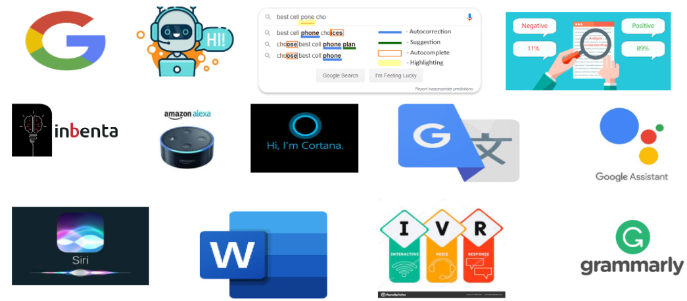

# Vous trouverez ici les Domaines d'application du NLP
[Home](./)     [Historique](./Historique.html)          [Techniques du NLP](./Techniques_du_NLP.html)        [Methodes du NLP](./Methodes_NLP.html) 

On l’ignore peut-être, mais de nombreuses applications qu’on utilise au quotidien reposent sur le traitement du langage naturel (NLP). On cite : 
- L’extraction d’information ou la recherche d’information (par exemple avec les moteurs de recherche Google, Inbenta etc.) 
- Création des chatbot de plus en plus « intelligents »
- Les assistants personnels tels que Apple Siri, Microsoft Cortana, Amazon Alexa ou Google assistant
- Analyse de sentiments : Cela peut par exemple permettre la surveillance des médias sociaux : Par exemple, détecter les tweets à sentiments négatifs pourrait permettre de réduire le harcèlement et le déferlement de violence se produisant sur Twitter. Ainsi l'analyse de sentiments peut être utilisée par exemple pour d’analyser la popularité d’un candidat politique et de prédire ainsi le vainqueur d’une élection présidentielle en se basent sur des tweets par exemple. Et cette analyse de sentiments peut par exemple permettre de suivre ce qui se dit à propos d’un produit ou service vendu par une entreprise et peut ainsi aider à détecter les clients en colère.
- Auto-correction orthographique et traduction
- Les traitements de texte comme Microsoft Word et Grammarly utilisent le NLP pour vérifier la grammaire et l’orthographe des textes. 
- Les applications de type Interactive Voice Response (IVR) utilisées par les centres d’appel permettent de traiter automatiquement certaines requêtes.

